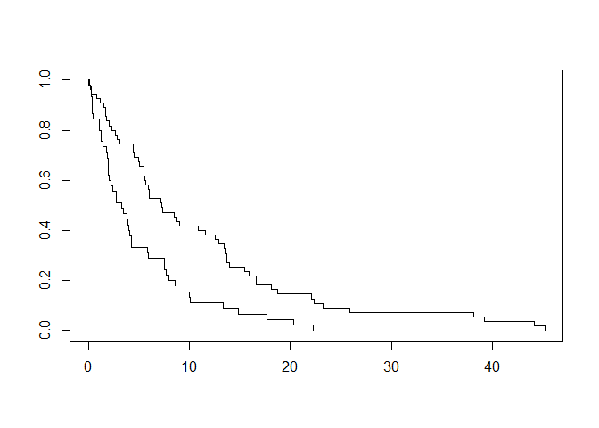

<!-- README.md is generated from README.Rmd. Please edit that file -->

# Project 2

<!-- badges: start -->

<!-- badges: end -->

The goal of project2 is to …

## Installation

You can install the released version of project2 from the development
version from [GitHub](https://github.com/) with:

``` r
# install.packages("devtools")
devtools::install_github("a-chernofsky/project2")
```

## Prerequisites

``` r

library(survival)
library(interval)
#> Loading required package: perm
#> Loading required package: Icens
#> Loading required package: MLEcens
#> Depends on Icens package available on bioconductor. 
#> To install use for example:
#> install.packages('BiocManager')
#> BiocManager::install('Icens')
library(project2)
```

## Simulating Cox Proportional Hazards model data

Assume \(T \sim Exp(\lambda)\) with

``` r
#simulate covariates
x1 <- rbinom(100, 1, 0.5)
x2 <- rnorm(100)
x3 <- factor(sample(c(1,2,3), size = 100, replace = T, prob = c(0.33, 0.33, 0.33)))

b <- c(0.5, -0.02, 0.1, 0.1)

simdata <- sim_cph(100, formula = ~ x1 + x2 + x3, beta = b, tfun = texp(0.1))
simdata$event <- 1

sfit <- survfit(Surv(t, event) ~ x1, data =simdata)
summary(sfit)
#> Call: survfit(formula = Surv(t, event) ~ x1, data = simdata)
#> 
#>                 x1=0 
#>    time n.risk n.event survival std.err lower 95% CI upper 95% CI
#>   0.031     55       1   0.9818  0.0180      0.94714        1.000
#>   0.173     54       1   0.9636  0.0252      0.91541        1.000
#>   0.289     53       1   0.9455  0.0306      0.88730        1.000
#>   0.846     52       1   0.9273  0.0350      0.86112        0.999
#>   1.138     51       1   0.9091  0.0388      0.83620        0.988
#>   1.536     50       1   0.8909  0.0420      0.81221        0.977
#>   1.709     49       1   0.8727  0.0449      0.78895        0.965
#>   1.713     48       1   0.8545  0.0475      0.76627        0.953
#>   1.821     47       1   0.8364  0.0499      0.74409        0.940
#>   2.098     46       1   0.8182  0.0520      0.72234        0.927
#>   2.335     45       1   0.8000  0.0539      0.70097        0.913
#>   2.677     44       1   0.7818  0.0557      0.67994        0.899
#>   2.846     43       1   0.7636  0.0573      0.65922        0.885
#>   3.146     42       1   0.7455  0.0587      0.63878        0.870
#>   4.410     41       1   0.7273  0.0601      0.61860        0.855
#>   4.431     40       1   0.7091  0.0612      0.59867        0.840
#>   4.511     39       1   0.6909  0.0623      0.57896        0.824
#>   4.929     38       1   0.6727  0.0633      0.55948        0.809
#>   5.080     37       1   0.6545  0.0641      0.54020        0.793
#>   5.498     36       1   0.6364  0.0649      0.52113        0.777
#>   5.507     35       1   0.6182  0.0655      0.50224        0.761
#>   5.606     34       1   0.6000  0.0661      0.48355        0.745
#>   5.666     33       1   0.5818  0.0665      0.46503        0.728
#>   5.959     32       1   0.5636  0.0669      0.44669        0.711
#>   6.010     31       1   0.5455  0.0671      0.42853        0.694
#>   6.044     30       1   0.5273  0.0673      0.41054        0.677
#>   7.215     29       1   0.5091  0.0674      0.39272        0.660
#>   7.285     28       1   0.4909  0.0674      0.37508        0.643
#>   7.380     27       1   0.4727  0.0673      0.35760        0.625
#>   8.466     26       1   0.4545  0.0671      0.34029        0.607
#>   8.793     25       1   0.4364  0.0669      0.32315        0.589
#>   9.021     24       1   0.4182  0.0665      0.30618        0.571
#>  10.885     23       1   0.4000  0.0661      0.28939        0.553
#>  11.580     22       1   0.3818  0.0655      0.27278        0.534
#>  12.567     21       1   0.3636  0.0649      0.25635        0.516
#>  12.917     20       1   0.3455  0.0641      0.24011        0.497
#>  13.425     19       1   0.3273  0.0633      0.22405        0.478
#>  13.519     18       1   0.3091  0.0623      0.20820        0.459
#>  13.679     17       1   0.2909  0.0612      0.19256        0.439
#>  13.691     16       1   0.2727  0.0601      0.17713        0.420
#>  13.922     15       1   0.2545  0.0587      0.16194        0.400
#>  15.487     14       1   0.2364  0.0573      0.14699        0.380
#>  15.919     13       1   0.2182  0.0557      0.13230        0.360
#>  16.612     12       1   0.2000  0.0539      0.11789        0.339
#>  16.651     11       1   0.1818  0.0520      0.10379        0.319
#>  18.107     10       1   0.1636  0.0499      0.09003        0.297
#>  18.744      9       1   0.1455  0.0475      0.07665        0.276
#>  22.099      8       1   0.1273  0.0449      0.06371        0.254
#>  22.346      7       1   0.1091  0.0420      0.05126        0.232
#>  23.233      6       1   0.0909  0.0388      0.03941        0.210
#>  25.898      5       1   0.0727  0.0350      0.02831        0.187
#>  38.162      4       1   0.0545  0.0306      0.01815        0.164
#>  39.158      3       1   0.0364  0.0252      0.00933        0.142
#>  44.149      2       1   0.0182  0.0180      0.00261        0.127
#>  45.168      1       1   0.0000     NaN           NA           NA
#> 
#>                 x1=1 
#>    time n.risk n.event survival std.err lower 95% CI upper 95% CI
#>   0.130     45       1   0.9778  0.0220       0.9356        1.000
#>   0.256     44       1   0.9556  0.0307       0.8972        1.000
#>   0.304     43       1   0.9333  0.0372       0.8632        1.000
#>   0.338     42       1   0.9111  0.0424       0.8316        0.998
#>   0.371     41       1   0.8889  0.0468       0.8017        0.986
#>   0.402     40       1   0.8667  0.0507       0.7728        0.972
#>   0.475     39       1   0.8444  0.0540       0.7449        0.957
#>   1.054     38       1   0.8222  0.0570       0.7178        0.942
#>   1.092     37       1   0.8000  0.0596       0.6913        0.926
#>   1.227     36       1   0.7778  0.0620       0.6653        0.909
#>   1.258     35       1   0.7556  0.0641       0.6399        0.892
#>   1.480     34       1   0.7333  0.0659       0.6149        0.875
#>   1.822     33       1   0.7111  0.0676       0.5903        0.857
#>   1.922     32       1   0.6889  0.0690       0.5661        0.838
#>   1.933     31       1   0.6667  0.0703       0.5422        0.820
#>   1.940     30       1   0.6444  0.0714       0.5187        0.801
#>   1.948     29       1   0.6222  0.0723       0.4955        0.781
#>   2.058     28       1   0.6000  0.0730       0.4727        0.762
#>   2.212     27       1   0.5778  0.0736       0.4501        0.742
#>   2.370     26       1   0.5556  0.0741       0.4278        0.721
#>   2.772     25       1   0.5333  0.0744       0.4058        0.701
#>   2.791     24       1   0.5111  0.0745       0.3841        0.680
#>   3.313     23       1   0.4889  0.0745       0.3626        0.659
#>   3.482     22       1   0.4667  0.0744       0.3415        0.638
#>   3.812     21       1   0.4444  0.0741       0.3206        0.616
#>   3.916     20       1   0.4222  0.0736       0.3000        0.594
#>   3.975     19       1   0.4000  0.0730       0.2797        0.572
#>   4.060     18       1   0.3778  0.0723       0.2597        0.550
#>   4.292     17       1   0.3556  0.0714       0.2399        0.527
#>   4.293     16       1   0.3333  0.0703       0.2205        0.504
#>   5.809     15       1   0.3111  0.0690       0.2014        0.481
#>   5.926     14       1   0.2889  0.0676       0.1827        0.457
#>   7.494     13       1   0.2667  0.0659       0.1643        0.433
#>   7.504     12       1   0.2444  0.0641       0.1462        0.409
#>   7.666     11       1   0.2222  0.0620       0.1286        0.384
#>   7.948     10       1   0.2000  0.0596       0.1115        0.359
#>   8.594      9       1   0.1778  0.0570       0.0948        0.333
#>   8.713      8       1   0.1556  0.0540       0.0787        0.307
#>   9.992      7       1   0.1333  0.0507       0.0633        0.281
#>  10.059      6       1   0.1111  0.0468       0.0486        0.254
#>  13.388      5       1   0.0889  0.0424       0.0349        0.227
#>  14.861      4       1   0.0667  0.0372       0.0223        0.199
#>  17.686      3       1   0.0444  0.0307       0.0115        0.172
#>  20.298      2       1   0.0222  0.0220       0.0032        0.154
#>  22.299      1       1   0.0000     NaN           NA           NA
plot(sfit)
```



## Simulating interval censored data

## Calculating RMST with right censored data

## Calculating RMST with interval censored data

## Example

This is a basic example which shows you how to solve a common problem:

``` r
library(project2)
## basic example code
```

What is special about using `README.Rmd` instead of just `README.md`?
You can include R chunks like so:

``` r
summary(cars)
#>      speed           dist       
#>  Min.   : 4.0   Min.   :  2.00  
#>  1st Qu.:12.0   1st Qu.: 26.00  
#>  Median :15.0   Median : 36.00  
#>  Mean   :15.4   Mean   : 42.98  
#>  3rd Qu.:19.0   3rd Qu.: 56.00  
#>  Max.   :25.0   Max.   :120.00
```

You’ll still need to render `README.Rmd` regularly, to keep `README.md`
up-to-date. `devtools::build_readme()` is handy for this. You could also
use GitHub Actions to re-render `README.Rmd` every time you push. An
example workflow can be found here:
<https://github.com/r-lib/actions/tree/master/examples>.

You can also embed plots, for example:


In that case, don’t forget to commit and push the resulting figure
files, so they display on GitHub and CRAN.
