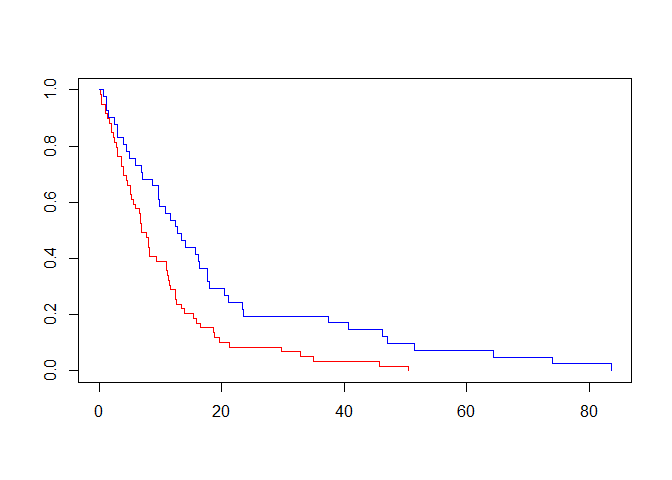
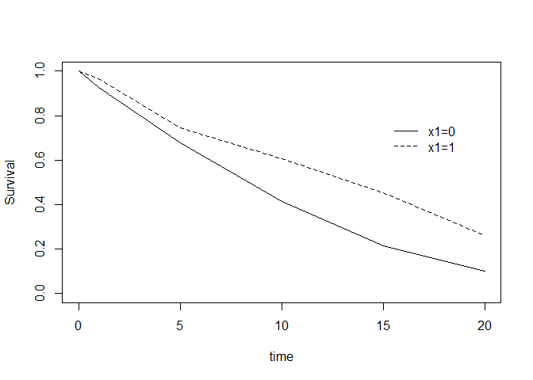

<!-- README.md is generated from README.Rmd. Please edit that file -->

``` r
knitr::opts_chunk$set(
  collapse = TRUE,
  comment = "#>",
  fig.path = "man/figures/README-",
  out.width = "100%"
)

set.seed(1233)
```

# Project 2

<!-- badges: start -->

<!-- badges: end -->

The goal of project2 is to to estimate the indirect and direct effects
of a treatment A on a time-to-event outcome T with a mediator M, when T
is interval censored. The primary purpose of the package is to provide
functions for estimating the indirect and direct effects from data. A
secondary goal is to provide functions to conduct a simulation study to
evaluate the proposed estimators. We deomonstrate the simulation
functionality of the package below.

## Installation

You can install the released version of project2 from the development
version from [GitHub](https://github.com/) with:

``` r
# install.packages("devtools")
devtools::install_github("a-chernofsky/project2")
```

## Prerequisites

``` r

library(survival)
library(interval)
#> Loading required package: perm
#> Loading required package: Icens
#> Loading required package: MLEcens
#> Depends on Icens package available on bioconductor. 
#> To install use for example:
#> install.packages('BiocManager')
#> BiocManager::install('Icens')
library(project2)
```

## Overview

1.  Simulate time-to-event outcome conditional on covariates using
    `sim_cph` with the following arguments:
    1.  `N` simulated sample size
    2.  `formula` or `X` defining the covariates
    3.  `beta` covariate effects  
    4.  `tfun` time function based on the assumed hazard function
2.  Create interval censored outcome based on when the simulated
    time-to-event occurs with `sim_interval` and the following
    arguments:
    1.  `t` true event times
    2.  `pmiss` probability of missing
    3.  `visits` a vector of study visit times
3.  Define a study visit schedule mimicking one way in which interval
    censored outcomes arise.
4.  Recognizing that subjects miss study visits, set a probability of a
    subject missing a specific visit.

## Simulating Cox Proportional Hazards model data

Bender 2005 discussed a method to simulate time-to-event data from a Cox
Proportional Hazards model with hazard function based on the probability
integral transformation theorem. The method involves inverting the
cumulative hazard function. While the method is generalized to any
hazard function, choosing from popular survival distributions such as
exponential, weibull, and gompertz provides a closed form inverse
function that is simple to define. The `sim_cph` currently has functions
to simulate survival times from these common distributions.

The `sim_cph` function takes the following arguments:

1.  `N` simulated sample size
2.  `formula` or `X` defining the covariates
3.  `beta` covariate effects  
4.  `tfun` time function based on the assumed hazard.

Assume the following CPH model with a constant baseline hazard function
:

 = \\lambda \\exp(\\beta_1 x_1 + \\beta_2 x_2 + \\beta_3 x_3).")

The variables  are simulated from the following distributions:

``` r
#simulate covariates
x1 <- rbinom(100, 1, 0.5)
x2 <- rnorm(100)
x3 <- factor(sample(c(1,2,3), size = 100, replace = T, prob = c(0.33, 0.33, 0.33)))
```

We now set the values for the
,
’s and
,

``` r
#N
n <- 100
#betas
b <- c(-0.5, -0.02, 0.01, 0.01)
#lambda
lam <- 0.1
```

There are two ways to input the covariates into `sim_cph`: 1. `X` as a
model matrix (use `model.matrix` function) 2. `formula` as a formula
e.g. `~x1 + x2 + x3`.

Make sure that any categorical variables are converted as factors
otherwise they will be treated as numeric.

``` r

t_data <- sim_cph(N = n, formula = ~ x1 + x2 + x3, 
                  beta = b, 
                  tfun = texp(lam))
```

We can use functions from the survival package to inspect the simulated
data:

``` r

t_data$event <- 1

sfit <- survfit(Surv(t, event) ~ x1, data = t_data)
summary(sfit)
#> Call: survfit(formula = Surv(t, event) ~ x1, data = t_data)
#> 
#>                 x1=0 
#>    time n.risk n.event survival std.err lower 95% CI upper 95% CI
#>   0.215     59       1   0.9831  0.0168      0.95066        1.000
#>   0.321     58       1   0.9661  0.0236      0.92101        1.000
#>   0.441     57       1   0.9492  0.0286      0.89472        1.000
#>   0.951     56       1   0.9322  0.0327      0.87021        0.999
#>   1.086     55       1   0.9153  0.0363      0.84688        0.989
#>   1.389     54       1   0.8983  0.0393      0.82440        0.979
#>   1.684     53       1   0.8814  0.0421      0.80259        0.968
#>   1.979     52       1   0.8644  0.0446      0.78132        0.956
#>   2.088     51       1   0.8475  0.0468      0.76051        0.944
#>   2.323     50       1   0.8305  0.0488      0.74009        0.932
#>   2.536     49       1   0.8136  0.0507      0.72001        0.919
#>   2.885     48       1   0.7966  0.0524      0.70025        0.906
#>   2.908     47       1   0.7797  0.0540      0.68076        0.893
#>   2.968     46       1   0.7627  0.0554      0.66153        0.879
#>   3.672     45       1   0.7458  0.0567      0.64254        0.866
#>   3.708     44       1   0.7288  0.0579      0.62376        0.852
#>   3.945     43       1   0.7119  0.0590      0.60519        0.837
#>   4.032     42       1   0.6949  0.0599      0.58682        0.823
#>   4.503     41       1   0.6780  0.0608      0.56863        0.808
#>   4.654     40       1   0.6610  0.0616      0.55062        0.794
#>   5.050     39       1   0.6441  0.0623      0.53278        0.779
#>   5.179     38       1   0.6271  0.0630      0.51511        0.763
#>   5.281     37       1   0.6102  0.0635      0.49759        0.748
#>   5.655     36       1   0.5932  0.0640      0.48023        0.733
#>   5.873     35       1   0.5763  0.0643      0.46302        0.717
#>   6.520     34       1   0.5593  0.0646      0.44596        0.701
#>   6.794     33       1   0.5424  0.0649      0.42905        0.686
#>   6.801     32       1   0.5254  0.0650      0.41228        0.670
#>   6.895     31       1   0.5085  0.0651      0.39565        0.653
#>   6.897     30       1   0.4915  0.0651      0.37917        0.637
#>   7.795     29       1   0.4746  0.0650      0.36283        0.621
#>   8.100     28       1   0.4576  0.0649      0.34663        0.604
#>   8.104     27       1   0.4407  0.0646      0.33058        0.587
#>   8.193     26       1   0.4237  0.0643      0.31467        0.571
#>   8.294     25       1   0.4068  0.0640      0.29891        0.554
#>   9.296     24       1   0.3898  0.0635      0.28329        0.536
#>  11.022     23       1   0.3729  0.0630      0.26783        0.519
#>  11.058     22       1   0.3559  0.0623      0.25252        0.502
#>  11.086     21       1   0.3390  0.0616      0.23737        0.484
#>  11.294     20       1   0.3220  0.0608      0.22239        0.466
#>  11.486     19       1   0.3051  0.0599      0.20757        0.448
#>  11.584     18       1   0.2881  0.0590      0.19294        0.430
#>  12.427     17       1   0.2712  0.0579      0.17848        0.412
#>  12.493     16       1   0.2542  0.0567      0.16423        0.394
#>  12.572     15       1   0.2373  0.0554      0.15018        0.375
#>  13.467     14       1   0.2203  0.0540      0.13634        0.356
#>  13.860     13       1   0.2034  0.0524      0.12275        0.337
#>  15.450     12       1   0.1864  0.0507      0.10941        0.318
#>  15.872     11       1   0.1695  0.0488      0.09635        0.298
#>  16.515     10       1   0.1525  0.0468      0.08360        0.278
#>  18.622      9       1   0.1356  0.0446      0.07119        0.258
#>  18.830      8       1   0.1186  0.0421      0.05918        0.238
#>  19.597      7       1   0.1017  0.0393      0.04764        0.217
#>  21.240      6       1   0.0847  0.0363      0.03664        0.196
#>  29.778      5       1   0.0678  0.0327      0.02632        0.175
#>  32.881      4       1   0.0508  0.0286      0.01688        0.153
#>  34.979      3       1   0.0339  0.0236      0.00868        0.132
#>  45.810      2       1   0.0169  0.0168      0.00243        0.118
#>  50.517      1       1   0.0000     NaN           NA           NA
#> 
#>                 x1=1 
#>    time n.risk n.event survival std.err lower 95% CI upper 95% CI
#>   0.777     41       1   0.9756  0.0241      0.92952        1.000
#>   1.155     40       1   0.9512  0.0336      0.88752        1.000
#>   1.181     39       1   0.9268  0.0407      0.85045        1.000
#>   1.489     38       1   0.9024  0.0463      0.81604        0.998
#>   2.514     37       1   0.8780  0.0511      0.78339        0.984
#>   2.913     36       1   0.8537  0.0552      0.75204        0.969
#>   2.919     35       1   0.8293  0.0588      0.72173        0.953
#>   4.047     34       1   0.8049  0.0619      0.69227        0.936
#>   4.469     33       1   0.7805  0.0646      0.66354        0.918
#>   4.928     32       1   0.7561  0.0671      0.63544        0.900
#>   5.971     31       1   0.7317  0.0692      0.60791        0.881
#>   6.949     30       1   0.7073  0.0711      0.58090        0.861
#>   7.005     29       1   0.6829  0.0727      0.55436        0.841
#>   8.777     28       1   0.6585  0.0741      0.52827        0.821
#>   9.610     27       1   0.6341  0.0752      0.50259        0.800
#>   9.696     26       1   0.6098  0.0762      0.47732        0.779
#>   9.882     25       1   0.5854  0.0769      0.45242        0.757
#>  10.748     24       1   0.5610  0.0775      0.42790        0.735
#>  11.598     23       1   0.5366  0.0779      0.40374        0.713
#>  12.493     22       1   0.5122  0.0781      0.37993        0.691
#>  12.841     21       1   0.4878  0.0781      0.35647        0.668
#>  13.449     20       1   0.4634  0.0779      0.33337        0.644
#>  14.151     19       1   0.4390  0.0775      0.31061        0.621
#>  15.694     18       1   0.4146  0.0769      0.28821        0.597
#>  16.200     17       1   0.3902  0.0762      0.26617        0.572
#>  16.374     16       1   0.3659  0.0752      0.24451        0.547
#>  17.711     15       1   0.3415  0.0741      0.22322        0.522
#>  17.762     14       1   0.3171  0.0727      0.20233        0.497
#>  17.994     13       1   0.2927  0.0711      0.18186        0.471
#>  20.465     12       1   0.2683  0.0692      0.16184        0.445
#>  21.162     11       1   0.2439  0.0671      0.14229        0.418
#>  23.361     10       1   0.2195  0.0646      0.12325        0.391
#>  23.496      9       1   0.1951  0.0619      0.10479        0.363
#>  37.418      8       1   0.1707  0.0588      0.08696        0.335
#>  40.751      7       1   0.1463  0.0552      0.06987        0.307
#>  46.208      6       1   0.1220  0.0511      0.05364        0.277
#>  47.107      5       1   0.0976  0.0463      0.03846        0.248
#>  51.568      4       1   0.0732  0.0407      0.02462        0.217
#>  64.462      3       1   0.0488  0.0336      0.01262        0.188
#>  73.976      2       1   0.0244  0.0241      0.00352        0.169
#>  83.617      1       1   0.0000     NaN           NA           NA
plot(sfit, col = c("red", "blue"))
```



We can fit a CPH model to check the results:

``` r
coxph(Surv(t, event) ~ x1 + x2 + x3, data = t_data)
#> Call:
#> coxph(formula = Surv(t, event) ~ x1 + x2 + x3, data = t_data)
#> 
#>        coef exp(coef) se(coef)      z       p
#> x1  -0.6244    0.5356   0.2196 -2.843 0.00447
#> x2  -0.0334    0.9672   0.1048 -0.319 0.75010
#> x32  0.1216    1.1293   0.2448  0.497 0.61938
#> x33  0.4598    1.5837   0.2661  1.728 0.08400
#> 
#> Likelihood ratio test=11.9  on 4 df, p=0.01815
#> n= 100, number of events= 100
```

## Simulating interval censored data

``` r

int_data <- sim_interval(t_data$t, pmiss = 0.10, visits = c(0, 1, 5, 10, 15, 20))

icfit <- icfit(Surv(l, r, type = "interval2") ~ x1, data = int_data)

plot(icfit, XLEG = 15, YLEG = 0.8, shade = F)
```



## Calculating RMST with right censored data

``` r

i1 <- summary(sfit)$strata == "x1=1"
i0 <- summary(sfit)$strata == "x1=0"
t1 <- summary(sfit)$time[i1]
s1 <- summary(sfit)$surv[i1]
t0 <- summary(sfit)$time[i0]
s0 <- summary(sfit)$surv[i0]
```

## Calculating RMST with interval censored data

``` r

rmst_ic(left = int_data$l[t_data$x1 == 1], 
        right = int_data$r[t_data$x1 == 1], 
        tau = 20)
#> [1] 12.21392
rmst_ic(left = int_data$l[t_data$x1 == 0], 
        right = int_data$r[t_data$x1 == 0], 
        tau = 20)
#> [1] 9.256934
```

\#\#Pseudo-observations
